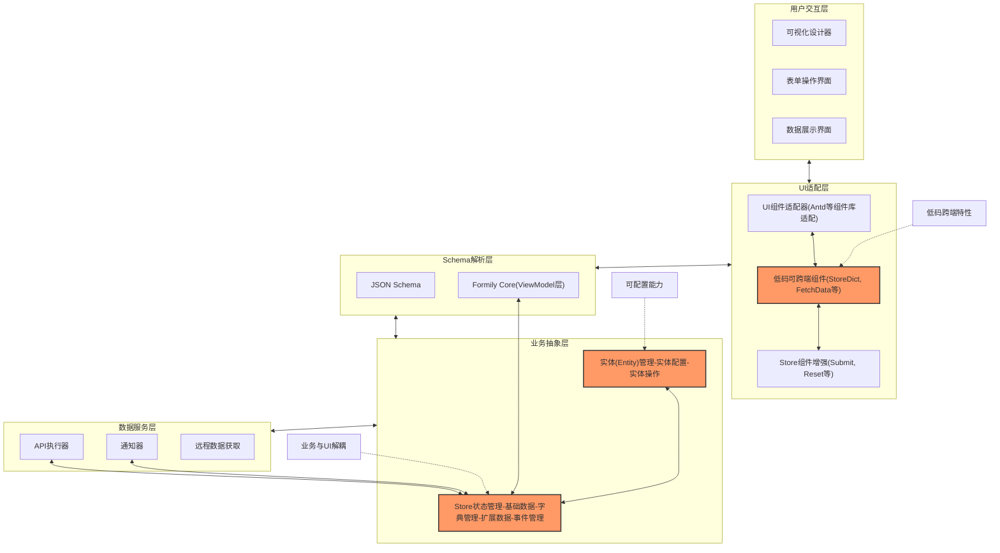

# 前端低代码开发指南

## 导读
本指南介绍了一个基于Formily的低代码开发框架，旨在解决复杂业务场景下低代码开发的痛点。框架通过Store管理业务数据、Entity封装业务逻辑、UI适配层处理视图展示，实现了业务与UI的解耦，提高了开发效率和代码复用性。

## 架构概览



上图展示了框架的五层架构：
1. **用户交互层**：最终用户所见的界面
2. **UI适配层**：处理组件适配和增强
3. **Schema解析层**：基于Formily的核心
4. **业务抽象层**：管理实体和状态
5. **数据服务层**：处理远程数据交互

## 基于 Formily 做为低代码引擎， 使用标准的 JSON Schema 做为 UI 描述
* Formily 基本能解决大部分低代码开发需求 https://formilyjs.org/zh-CN/guide
* JSON Schema 是描述 UI 的标准，可以等价于 JSX https://json-schema.org/understanding-json-schema/about

## 扩展
### 为什么需要扩展？
* 在前端的 MVVM 框架中， 数据驱动视图， 视图驱动数据，而 Formily 为了减少对业务的侵入，本身并不管 Model 这层实际业务数据。
* Formily 它提供了 View 和 ViewModel 两层能力，View 则是 @formily/react @formily/vue，专门用来与 @formily/core 做桥接通讯的。 @formily/core 的定位 是 ViewModel层

### 扩展的思路
* 用一个 Store 来管理 Model 层, 来实现通用的业务数据管理
* 将 Store 与 Formily 的 ViewModel 层进行桥接，来实现业务数据与 UI 的联动
* 将 Store 与 UI 组件进行结合, 即可实现 业务组件 如 Submit 按钮，可以实现点击按钮，调用接口, loading 和 disabled 从 Store 中获取。
* 建立实体，将实体的配置、操作、数据、事件等进行统一管理，并将其封装成与 UI 无关可跨端的业务组件。
* 开低码可跨端组件和功能，主要是一些常见通用的数据处理和组件适配，简化 UI 组件适配和降低其成本
* UI 组件的适配
* Store 组件的增强

### 扩展之 Store
* 利用依赖注入, 定义通用的 API 执行器 和 通知器, 业务接入时，只需按定义的接口实现即可。
* 有了 API 执行器 那么在 Store 中就可以实现远程数据的统一管理如定义：默认值、值、接口配置、loading、response 等
* 有了通知器，那么对于接口请求成功、失败是否通知、通知的类型、通知的样式、通知的标题、通知的内容等都可以统一管理。
* 基础数据: defaultValues, values loading response 以及对应的方法如 fetch 、setValues 、setLoading 、setResponse 等
* 字典管理: 为了满足低代码的可配置，将字典拆分字典配置 和 字典数据，通过字典配置来获取字典数据。字典配置可以通过 API 执行器来获取远程数据，也支持监测值的变化来更新字典数据，如省市区选择。
* 扩展数据: 为了满足不同的业务场景，提供扩展数据，并提供 setExtInfo 和 getExtInfo 来管理扩展数据。
* 事件管理: 提供 on、off、emit 来管理事件，可做为基础的事件总线，提供组件间通讯。

### 扩展之 Entity(实体) 和 实体操作
 实体对应的是 DDD 中业务生命周期的领域对象，主要就是封装业务逻辑。简单点说就是利用 Store 来管理业务数据，利用 Entity 来管理业务逻辑，实现 CRUD 操作。
#### 实体配置:
```ts
export interface IEntityConfig<V extends object = IAnyObject> {
  /** 实体名称 */
  name?: string;
  /** 实体的唯一标识字段，默认 id */
  idKey?: string;
  /** 批量操作的唯一标识字段，默认 ids */
  idsKey?: string;
  /** 实体的显示字段，默认 name */
  labelKey?: string;
  /** 基础路径 */
  basePath?: string;
  /** 路径配置，如 add: '/add' edit: '/edit' */
  path?: Record<IAPIKey, string>;
  /** 页面的面包屑配置 */
  breadcrumb?: IBreadcrumbItem[];
  /** 字段配置 */
  fieldsConfig?: IFieldsConfig;
  /** 接口配置 */
  api?: Record<IAPIKey, IAPIRequestConfig>;
  /** 字典 map 映射配置，如 status: { 1: '启用', 0: '禁用' } */
  map?: Record<IObjKey, IAnyObject>;
  /** 字典选项配置，如 status: [{ label: '启用', value: 1 }, { label: '禁用', value: 0 }] */
  options?: Record<IObjKey, IOptions>;
  /** 表单默认值，用于添加/编辑页面，编辑会多一个 idKey */
  defaultFormValues?: Partial<V>;
  /** 查询默认参数的值，用于列表/查询页面 */
  defaultQueryValues?: Partial<V> & IAnyObject;
  /** 详情默认参数的值，用于详情页面 */
  defaultDetailValues?: IAnyObject;

  [key: IObjKey]: IAny;
}
```
#### 实体操作:
有了 store 和 约定好了实体配置，那么就可以实现实体操作了，并将其封装成与 UI 无关可跨端的业务组件。根据常见的业务场景，可以实现如下的实体操作：
* 列表 EntityList 如用户列表
* 添加 EntityAdd 如用户添加
* 编辑 EntityEdit 如用户编辑
* 详情 EntityDetail 如用户详情
* 操作 EntityOperation 可实现 删除、 禁用、 启用、 导出、 导入、 批量操作等

### 扩展之 低码可跨端组件/能力:
formily/react 本身就提供了 connect、mapProps、mapReadPretty 等能力，大部分场景下，可用其适配各端 UI 组件，但 formily 大部分场景是针对表单，在数据展示方面，相比弱一下

#### 低码可跨端组件:
* StoreDict Store 字典组件 用来获取字典数据
* StoreRoute Store 路由组件 用来实现路由参数与 values 的联动
* FetchData 通用的低码接口请求组件
* RenderAny 通用的低码数据展示组件
* Trigger 通用的低码事件触发组件
* RenderArray 通用的低码数组展示组件
* SchemaItemRecursion 通用的低码数组 Item 递归组件
* SchemaItemRender 通用的低码数组 Item 展示组件
* EntityResponse 通用的低码接口响应组件（需依赖注入：Loading Skeleton ErrorContent UI 组件）
#### 一些 hooks
* useAdditionalNode 用来支持在 Schema 中为组件添加自定义 ReactNode
* useChildrenWithoutFragment 用来解决低码中 Fragment 嵌套问题
* useComponentData 用来获取组件数据
* useComponents 用来获取低码定义可用组件
* useDeepEffect 用来解决低码中深层依赖问题
* useDeepLayoutEffect 用来解决低码中深层依赖问题
* useDeepMemo 用来解决低码中深层依赖问题
* useFetchData 用来获取接口数据
* useRecordIndexFn 用来获取数组索引
* useSchemaItemsToColumns 用来将 Schema items 转换为 Columns （表格）
* useSchemaItemsToItems 用来将 Schema items 转换为 Items （items 组件，如 tabs,menu 等）
* useInitStore 根据实体配置和store 配置初始化 Store

### 扩展之 UI 组件适配
1. 将数组件的 value 和 onChange 与 formily 的标准对齐，例如 onChange 第一个参数必须为 newValue，而不是 event, 遇到这种情况，可取 event.target.value 作为 newValue，而 event 作为第二个参数，如适配 antd 的 Input 组件
```tsx
const Input = (props) => {
  const { value, onChange, ...rest } = props;
  return <Input value={value} onChange={(event) => onChange(event.target.value, event)} {...rest} />;
};
```
2. value 数据类型不一致，在一些多选的组件中，value 的数据类型为数组，而 store 中的值为字符串，如适配 antd 的 Select 组件, 可添加一个 props valueType: 'array'|'string' 和 splitter 来解决
```tsx
const Select = (props) => {
  const { value, onChange, valueType,mode, splitter, ...rest } = props;
  const curValue = useMemo(() => {
    if (mode && ['multiple', 'tags'].includes(mode) && typeof value === 'string') {
      return strToArr(value, splitter);
    }
    return value;
  }, [mode, splitter, value]);
 return (
    <AntSelect
      {...rest}
      mode={mode}
      value={curValue}
      onChange={(val, options) => {
        onChange?.(valueType === 'string' && Array.isArray(val) ? val.join(splitter) : val, options);
      }}
    />
  );
};
```
还有典型的时间/日期组件， 如 DatePicker 组件，值是一个 dayjs, 而 store 中是时间戳或字符串， 如适配 antd 的 DatePicker 组件, 可添加一个 props valueType 来解决
```tsx
const DatePicker = (props) => {
  const { value, onChange, valueType,format,picker ...rest } = props;
  const onChange = (date, dateString) => {
    if (!date) {
      onChange(dateString, date);
    } else if (valueType === 'dayjs') {
      onChange(date, date);
    } else if (valueType === 'second') {
      onChange(date.unix(), date);
    } else if (valueType === 'millisecond') {
      onChange(date.valueOf(), date);
    } else {
      onChange(dateString, date);
    }
  };
  return <DatePicker value={valueToDayjs(value, valueType, format, picker)} onChange={onChange} {...rest} />;
};
```
3. prop 为 ReactNode 组件的支持,通过 useAdditionalNode 来支持
```json
{
  "type": "object",
  "properties": {
    "num":{
      "type": "number",
      "x-component": "InputNumber",
      "x-additional-schema":{
        "prefix":{
          "type": "void",
          "x-component": "Icon",
          "x-component-props": {
            "icon": "icon-yuan"
          }
        },
      }
    }
  }
}
```

```tsx
export const InputNumber=(props) => {
  const { prefix, suffix, addonBefore, addonAfter, ...rest } = props;
  const curPrefix = useAdditionalNode('prefix', prefix);
  const curSuffix = useAdditionalNode('suffix', suffix);
  const curAddonBefore = useAdditionalNode('addonBefore', addonBefore);
  const curAddonAfter = useAdditionalNode('addonAfter', addonAfter);

  return (
    <AntInputNumber
      {...rest}
      addonAfter={curAddonAfter}
      addonBefore={curAddonBefore}
      prefix={curPrefix}
      suffix={curSuffix}
    />);
};
```
4. 远程数据支持，全局已经有 API 执行器，那么就可以在组件中实现远程数据的加载，如 Select 的 options，针对这个 我们可以统一的使用 RemoteSelect 来表示，这一项并非必要，因为其实可以通过 store 中的字典来实现

5. 搜索组件，同样因为有 API 执行器，那么就可以在组件中实现搜索，Search 组件，且可配置 UI 组件展示为 Select or AutoComplete，在具体业务中甚至可以封闭 SearchUser 组件，来实现用户搜索

6. 弹出组件，在低码中，很难去定义变量和操作变量来控制弹出的 open, 所以需要对弹出相关的组件进行改造。通过触发器来控制弹出组件的 open 状态，如 Trigger 组件

```tsx
export const Drawer = (props: DrawerProps) => {
  const { trigger, triggerText, onOpen, open: oldOpen, title, onClose, closeIcon, extra, footer, ...rest } = props;
  const [open, setOpen] = useState(oldOpen);
  const extraNode = useAdditionalNode('extra', extra);
  const footerNode = useAdditionalNode('footer', footer);
  const titleNode = useAdditionalNode('title', title);

  useEffect(() => {
    setOpen(oldOpen);
  }, [oldOpen]);

  return (
    <>
      {trigger !== false && (
        <Trigger
          children={triggerText ?? titleNode}
          component={Button}
          {...trigger}
          onTrig={(...args) => {
            setOpen(true);
            trigger?.onTrig?.(...args);
            onOpen?.(...args);
          }}
        />
      )}
      <AntDrawer
        {...rest}
        closeIcon={strToIcon(closeIcon)}
        extra={extraNode}
        footer={footerNode}
        open={open}
        title={titleNode}
        onClose={(e) => {
          setOpen(false);
          onClose?.(e);
        }}
      />
    </>
  );
};
```

### 扩展之 Store 组件增强
为了在低代码中尽量少 code,那么就需要有一些组件，可以直接操作 store 中的数据。最常见的提交按钮 重置按钮
* 提交按钮, 通过 store 的 loading 和 disabled 来控制按钮的 loading 和 disabled 状态
```tsx
export const Submit = observer((props: Omit<ButtonProps, 'loading' | 'disabled' | 'htmlType'> & { store?: IStore }) => {
  const { store, ...rest } = props;
  const curStore = useStore(store);

  return (
    <Button
      children='提交'
      type='primary'
      {...rest}
      disabled={curStore?.form?.disabled || !!curStore?.form?.errors?.length}
      htmlType='submit'
      loading={curStore?.loading}
    />
  );
});
```
* 重置按钮, 通过 store 的 reset 方法来重置表单
```tsx
export const Reset = (props: ButtonProps & { store?: IStore }) => {
  const { onClick, onKeyDown, store, ...rest } = props;
  const curStore = useStore(store);

  return (
    <Button
      children='重置'
      {...rest}
      onClick={(e) => {
        onClick?.(e);
        curStore?.resetValues();
      }}
      onKeyDown={(e) => {
        onKeyDown?.(e);
        if (e.key === 'Enter') {
          curStore?.resetValues();
        }
      }}
    />
  );
};
```
* ListFilter 列表筛选组件, 通过与 store 中的查询参数进行联动，提供 Submit 和 Reset 按钮,来实现列表的搜索
* StoreForm 有了 store 就可以直接与 form 进行关联
* StoreTable 表格组件, 不受控，则获取 store 中的数据和状态如 loading 进行展示，如受控其分页、排序、筛选可以直接与 store 中的数据进行关联，并在对应的操作后，执行 API 或者 更新 store 中的数据
* StoreDesc 描述组件, 通过与 store 中的数据进行关联，来实现描述的展示 常见于详情页面
* StoreAction 操作组件, 通过与 store 和 实体中的数据或配置进行关联，实现相关操作。如 删除、禁用、启用、导出、导入、批量操作等

## designable 低代码可视化设计器 （待实现）
### 基于  https://github.com/alibaba/designable 实现
designable 已经很久没更新了 目前也基本不维护了 使用的 UI 也是 antd 4.x 的版本
#### 对 designable 的改造
* 对 designable/shared designable/core 和 designable/react designable/react-sandbox 利用 AI 进行中文注释，生成READMD，修复 eslint 问题、完善单例测试,
* 对 designable/react-settings-form 进行重构，移除依赖 @formily/antd 和 antd 改为项目自行适配的 antd,
* 添加对 Store 的适配
* 添加对 Entity 的适配

## 利用低代码实现 SAAS 中的租户定制 （待实现）
在 SAAS 中，租户定制是一个非常常见的需求，通常整体业务流程差异不大，是一些参数的输入输出或者表格的展示需要定制，可以利用低代码的特性，实现租户定制的灵活性和可扩展性。
#### 租户定制的实现
* 平台侧给出一份标准的 JSON Schema 和 实体/Store 的配置, 配置中也声明了哪部分可以进行修改
* 租户侧不提供全功能的设计器（功能越多，越难用），提供一个简易的设计器 对 JSON Schema 进行修改，如调整字段的顺序，删除字段 添加字段，或者简单的修改界面的样式
* 租户的多级实现，租户管理员修改配置后，影响租户所有员工，员工也可进行修改，但只影响自己的界面，如不同员工需要查看的表格字段不一样

## 低代码页面的快速生成 （待实现）
### 提供多级模板 从 字段配置 到 Store 再到 Entity 再到 低代码页面的模板
### 基于 open api 的低代码页面生成，导入接口文档 根据模板生成低代码页面
### 基于 AI 的低代码页面生成，根据自然语言描述生成低代码页面
