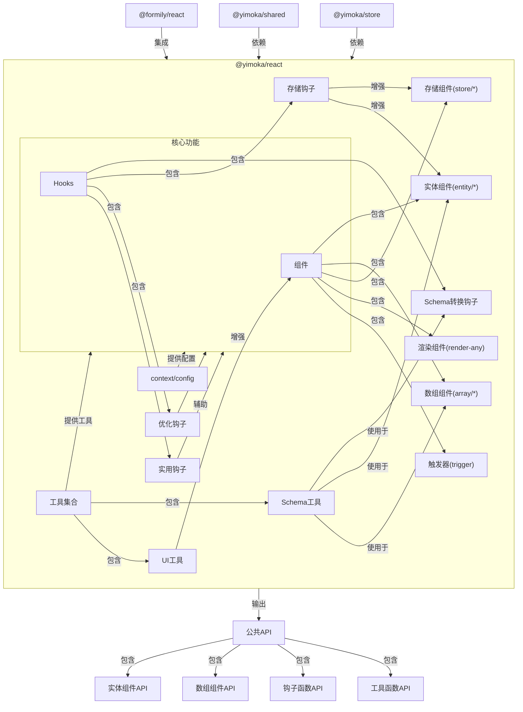

# @yimoka/react

## 项目简介

`@yimoka/react` 是一个基于 React 和 Formily 的组件库，专注于提供快速构建企业级表单、数据展示和实体操作的解决方案。该库集成了 Formily 的表单能力，并扩展了一系列实用的组件和钩子函数，用于简化复杂数据处理和界面构建。

## 架构图

```
@yimoka/react
├── components/           # 组件集合
│   ├── array/            # 数组相关组件
│   │   ├── render-array  # 数组渲染组件
│   │   ├── schema-item-recursion  # Schema递归组件
│   │   └── schema-item-render     # Schema渲染组件
│   ├── entity/           # 实体操作相关组件
│   │   ├── add           # 实体添加
│   │   ├── base          # 实体基础组件
│   │   ├── detail        # 实体详情
│   │   ├── edit          # 实体编辑
│   │   ├── list          # 实体列表
│   │   ├── operation     # 实体操作
│   │   ├── response      # 实体响应处理
│   │   └── schema        # 实体Schema定义
│   ├── store/            # 存储相关组件
│   │   ├── dict          # 字典存储
│   │   ├── route         # 路由存储
│   │   └── watchChildStore  # 子存储监控
│   ├── render-any        # 通用渲染组件
│   ├── trigger           # 触发器组件
│   └── fetch-data        # 数据获取组件
├── context/              # 上下文
│   └── config            # 配置上下文
├── hooks/                # 钩子函数集合
│   ├── additional-node   # 附加节点钩子
│   ├── array-string-transform  # 数组字符串转换
│   ├── children-without-fragment  # 无Fragment子组件处理
│   ├── component-data    # 组件数据钩子
│   ├── components        # 组件相关钩子
│   ├── deep-effect       # 深度Effect
│   ├── deep-memo         # 深度Memo
│   ├── record-index-fn   # 记录索引函数
│   ├── root              # 根组件钩子
│   ├── schema-items-to-items  # Schema转Items
│   ├── schema-items-to-columns  # Schema转Columns
│   ├── splitter          # 分隔器钩子
│   ├── store             # 存储钩子
│   └── fetch-data        # 数据获取钩子
└── tools/                # 工具集合
    ├── schema-items      # Schema项目工具
    └── tooltip           # 提示工具
```

## 组件架构关系图



## 核心特性

- 🔄 与 Formily 深度集成，提供强大的表单处理能力
- 🏗️ 实体操作组件（Entity），简化增删改查操作
- 📊 数据展示与转换工具，支持 Schema 到表格列的自动转换
- 🧰 丰富的 React Hooks，提升开发效率
- 🔌 灵活的存储机制组件，支持字典、路由和 Store 解析实现
- 🎯 深度集成 TypeScript，提供完整类型定义

## 安装

```bash
npm install @yimoka/react
```

或

```bash
yarn add @yimoka/react
```

## 依赖

本组件库依赖以下主要包:

- @formily/core: ^2.3.3
- @formily/json-schema: ^2.3.3
- @formily/react: ^2.3.3
- @formily/reactive: ^2.3.3
- @yimoka/shared: 工作区依赖
- @yimoka/store: 工作区依赖
- react: ^18.3.1

## 开发指南

### 代码规范

- 使用函数式组件和 React Hooks
- 组件命名使用 PascalCase
- 文件名使用 kebab-case
- 确保完整的 TypeScript 类型定义
- 代码文件必须包含中文注释，遵循 Typedoc 规范

### 测试要求

- 使用 Vitest 进行测试
- 测试覆盖率必须达到 95% 以上
- 测试文件必须使用 .test.ts 或 .test.tsx 后缀
- 测试文件存放在源文件的 __tests__ 目录下

## 贡献指南

欢迎提交 Pull Request 或 Issue。在提交前，请确保：

1. 代码符合项目规范
2. 所有测试通过
3. 提供组件文档和示例

## 协议

MIT
