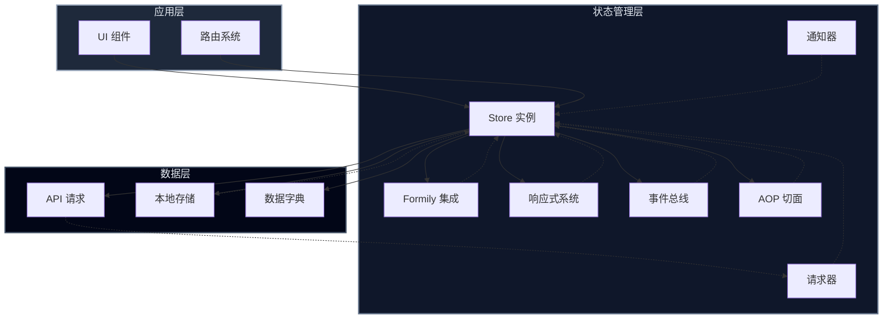
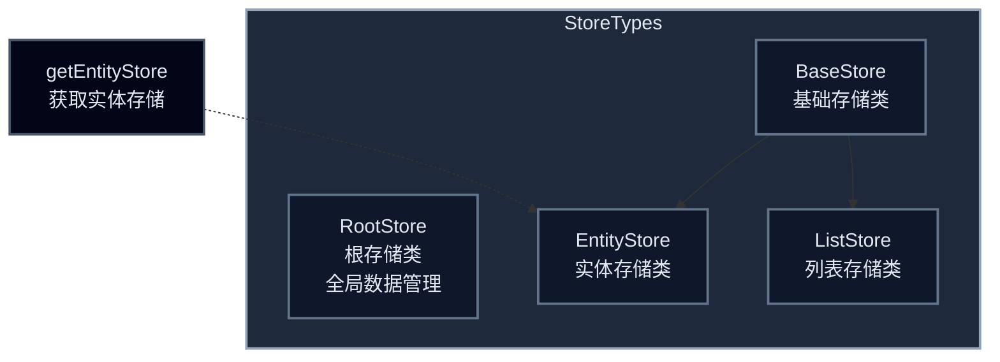

# @yimoka/store

一个基于 Formily 的响应式状态管理库，用于处理前端应用中的复杂数据流和表单状态。

## 项目概述

### 核心功能
- 响应式状态管理：基于 Formily Reactive 实现
- 表单状态管理：集成 Formily Core 和 JSON Schema
- 数据持久化：支持 API 请求和本地存储
- 路由集成：支持与路由参数双向绑定
- 字典管理：支持动态数据字典加载和缓存
- 通知系统：内置状态变更通知机制

### 技术栈
- TypeScript
- Formily Core
- Formily Reactive
- Formily JSON Schema
- Lodash ES

### 适用场景
- 中后台管理系统
- 复杂表单应用
- 需要状态管理的单页应用
- 需要与后端 API 交互的前端应用

### 架构图


### Store 类型


## 安装指南

### 环境要求
- Node.js >= 14
- TypeScript >= 4.0
- 支持 ESM 的现代浏览器

### 依赖安装
```bash
# npm
npm install @yimoka/store

# yarn
yarn add @yimoka/store

# pnpm
pnpm add @yimoka/store
```

### 配置项说明
```typescript
interface IBaseStoreConfig {
  defaultValues?: object;        // 默认值
  fieldsConfig?: object;        // 字段配置
  dictConfig?: object[];        // 字典配置
  apiExecutor?: Function;       // API执行器
  api?: object;                 // API配置
  options?: {
    filterBlankAtRun?: boolean; // 是否过滤空值
    bindRoute?: boolean;        // 是否绑定路由
    updateRouteType?: 'push' | 'replace'; // 路由更新方式
    routeTrigger?: 'unequal' | 'any';     // 路由触发条件
    runNow?: boolean;           // 是否立即执行
    urlWithDefaultFields?: string[]; // URL默认字段
    keys?: Record<string, string>;   // 字段键配置
  };
}
```

## 使用示例

### API调用示例
```typescript
// 创建基础存储实例
const store = new BaseStore({
  api: {
    url: '/api/users',
    method: 'GET'
  },
  defaultValues: {
    page: 1,
    pageSize: 10
  }
});

// 获取数据
await store.fetch();
```

### UI组件调用示例
```typescript
// 列表组件示例
const ListComponent = observer(() => {
  const store = useStore(ListStore);
  
  return (
    <Table
      dataSource={store.listData}
      loading={store.loading}
      pagination={store.pagination}
    />
  );
});
```

## 测试说明

### 运行单元测试
```bash
# 运行所有测试
pnpm test

# 监视模式运行测试
pnpm test-watch
```

## 扩展性说明

### 添加新模块
1. 在 `src` 目录下创建新的模块文件
2. 实现必要的接口和类型定义
3. 在 `index.ts` 中导出新模块
4. 添加相应的单元测试
5. 更新类型定义文件

### 自定义扩展点
- API执行器：通过 `apiExecutor` 配置自定义请求处理
- 通知系统：通过 `notifier` 配置自定义通知处理

## 许可证

MIT
